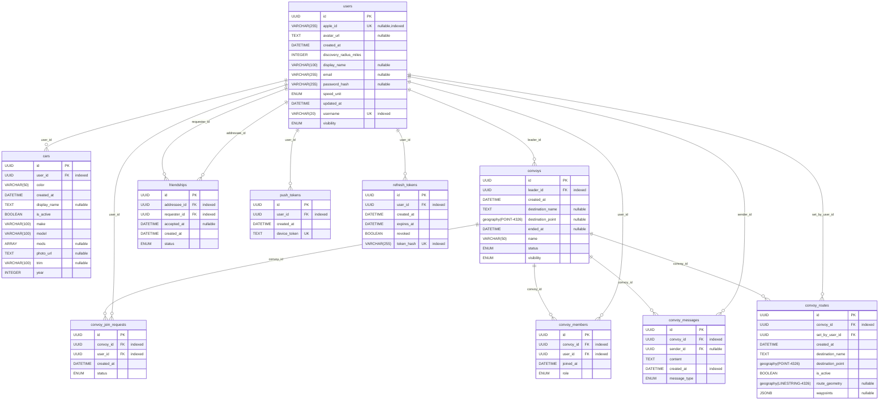

# SlipStream Postgres Schema
<!-- BEGIN_SQLALCHEMY_DOCS -->

```mermaid
erDiagram
  cars {
    UUID id PK
    UUID user_id FK "indexed"
    VARCHAR(50) color
    DATETIME created_at
    TEXT display_name "nullable"
    BOOLEAN is_active
    VARCHAR(100) make
    VARCHAR(100) model
    ARRAY mods "nullable"
    TEXT photo_url "nullable"
    VARCHAR(100) trim "nullable"
    INTEGER year
  }

  convoy_join_requests {
    UUID id PK
    UUID convoy_id FK "indexed"
    UUID user_id FK "indexed"
    DATETIME created_at
    ENUM status
  }

  convoy_members {
    UUID id PK
    UUID convoy_id FK "indexed"
    UUID user_id FK "indexed"
    DATETIME joined_at
    ENUM role
  }

  convoy_messages {
    UUID id PK
    UUID convoy_id FK "indexed"
    UUID sender_id FK "nullable"
    TEXT content
    DATETIME created_at "indexed"
    ENUM message_type
  }

  convoy_routes {
    UUID id PK
    UUID convoy_id FK "indexed"
    UUID set_by_user_id FK
    DATETIME created_at
    TEXT destination_name
    geography(POINT-4326) destination_point
    BOOLEAN is_active
    geography(LINESTRING-4326) route_geometry "nullable"
    JSONB waypoints "nullable"
  }

  convoys {
    UUID id PK
    UUID leader_id FK "indexed"
    DATETIME created_at
    TEXT destination_name "nullable"
    geography(POINT-4326) destination_point "nullable"
    DATETIME ended_at "nullable"
    VARCHAR(50) name
    ENUM status
    ENUM visibility
  }

  friendships {
    UUID id PK
    UUID addressee_id FK "indexed"
    UUID requester_id FK "indexed"
    DATETIME accepted_at "nullable"
    DATETIME created_at
    ENUM status
  }

  push_tokens {
    UUID id PK
    UUID user_id FK "indexed"
    DATETIME created_at
    TEXT device_token UK
  }

  refresh_tokens {
    UUID id PK
    UUID user_id FK "indexed"
    DATETIME created_at
    DATETIME expires_at
    BOOLEAN revoked
    VARCHAR(255) token_hash UK "indexed"
  }

  users {
    UUID id PK
    VARCHAR(255) apple_id UK "nullable,indexed"
    TEXT avatar_url "nullable"
    DATETIME created_at
    INTEGER discovery_radius_miles
    VARCHAR(100) display_name "nullable"
    VARCHAR(255) email "nullable"
    VARCHAR(255) password_hash "nullable"
    ENUM speed_unit
    DATETIME updated_at
    VARCHAR(20) username UK "indexed"
    ENUM visibility
  }

  users ||--o{ cars : user_id
  convoys ||--o{ convoy_join_requests : convoy_id
  users ||--o{ convoy_join_requests : user_id
  convoys ||--o{ convoy_members : convoy_id
  users ||--o{ convoy_members : user_id
  convoys ||--o{ convoy_messages : convoy_id
  users ||--o{ convoy_messages : sender_id
  convoys ||--o{ convoy_routes : convoy_id
  users ||--o{ convoy_routes : set_by_user_id
  users ||--o{ convoys : leader_id
  users ||--o{ friendships : requester_id
  users ||--o{ friendships : addressee_id
  users ||--o{ push_tokens : user_id
  users ||--o{ refresh_tokens : user_id

```
<!-- END_SQLALCHEMY_DOCS -->
